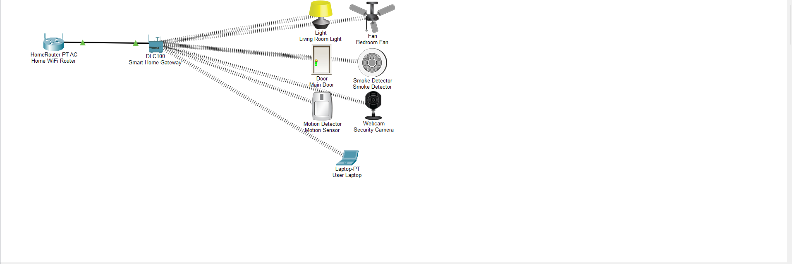

# Smart Home Automation Using Cisco Packet Tracer

## Project Overview

This project presents a basic Smart Home Automation System designed and simulated using Cisco Packet Tracer. The system demonstrates how IoT devices can be connected through a Home WiFi Router and a Smart Home Gateway to create a connected and centrally managed home environment.

The project was developed as part of an Internet of Things (IoT) Internship.

## Objective

The main objectives of this project are:

- To design and simulate a basic IoT-based Smart Home Automation System.
- To understand wireless connectivity between IoT devices.
- To demonstrate centralized monitoring and management of smart home devices.
- To understand the basic architecture and communication of an IoT-enabled home network.

## Software Used

- Cisco Packet Tracer 9.0.1

## Components Used

- Home WiFi Router
- Smart Home Gateway (DLC100)
- Living Room Light
- Bedroom Fan
- Main Door
- Motion Sensor
- Smoke Detector
- Security Camera (Webcam)
- User Laptop

## Network Architecture

The Home WiFi Router provides network connectivity to the Smart Home Gateway. The Smart Home Gateway acts as the central communication hub for the connected IoT devices.

The Living Room Light, Bedroom Fan, Main Door, Motion Sensor, Smoke Detector, and Security Camera are wirelessly connected to the Smart Home Gateway. The User Laptop is also connected to the network for monitoring and interaction with the smart home devices.

## Working

The system operates through a centralized Smart Home Gateway.

- The **Home WiFi Router** provides network connectivity.
- The **Smart Home Gateway** manages the connected IoT devices.
- The **Motion Sensor** detects movement and can be used for security-related actions.
- The **Smoke Detector** monitors the environment for smoke and fire hazards.
- The **Security Camera** provides surveillance functionality.
- The **Main Door** represents controlled access to the home.
- The **Living Room Light** and **Bedroom Fan** represent smart household appliances.
- The **User Laptop** allows the user to interact with and monitor the smart home network.

## Advantages

- Improves home security through smart monitoring devices.
- Enables monitoring and control of household appliances.
- Supports centralized management of multiple IoT devices.
- Provides greater convenience and comfort.
- Demonstrates practical application of IoT technology.
- Can contribute to efficient control of household devices.

## Applications

Smart Home Automation concepts can be applied in:

- Smart Homes
- Smart Buildings
- Offices
- Hotels
- Hospitals
- Educational Institutions
- Industrial Automation

## Project Topology

## How to Open the Project

1. Install **Cisco Packet Tracer 9.0.1** or a compatible version.
2. Download `Home_Automation_Project_Final.pkt`.
3. Open the `.pkt` file in Cisco Packet Tracer.
4. Explore the network topology and connected IoT devices.

## Project Files

- `Home_Automation_Project_Final.pkt` — Cisco Packet Tracer project
- `Home_Automation_Topology.png` — Network topology screenshot

## Conclusion

The Smart Home Automation System was successfully designed and simulated using Cisco Packet Tracer. The project demonstrates how multiple IoT devices can communicate through a Smart Home Gateway connected to a Home WiFi Router.

The project provides practical exposure to IoT concepts, wireless communication, smart home architecture, and centralized device management.

## Author

**Rudraksh Ranjan Panda**

B.Tech — Computer Science and Engineering (CSE)
